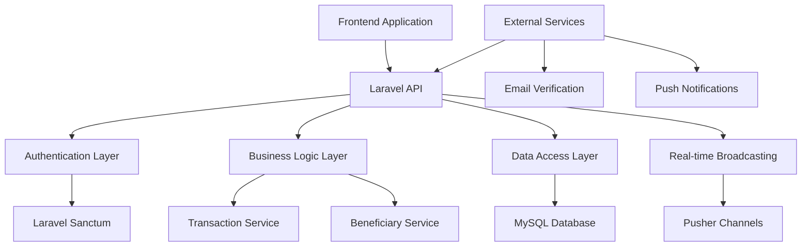
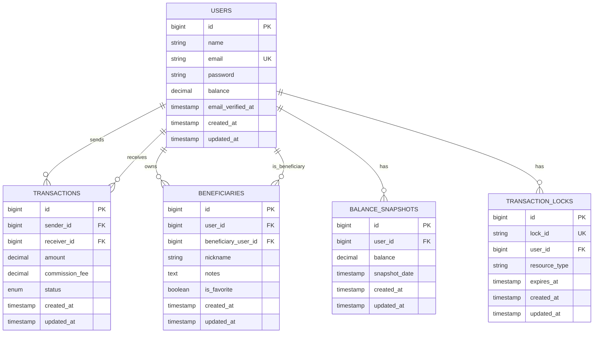

# 💳 Mini Wallet API

A comprehensive Laravel 11 API application for managing digital wallet transactions with advanced features including beneficiary management, real-time notifications, and professional-grade security.

## 👨‍💻 Author
**Eng.Fahed** - Full Stack Developer

## ✨ Features

### 🔐 Authentication & Security
- **Laravel Sanctum** authentication with token-based API access
- **Email verification** for all user accounts
- **Password hashing** with Laravel's built-in security
- **CORS support** for cross-origin requests

### 💰 Wallet Management
- **Real-time balance** tracking and updates
- **Transaction history** with pagination and filtering
- **Commission fee** calculation (1.5% default)
- **Balance validation** with detailed error messages
- **Money transfer** between verified users

### 👥 Beneficiary Management
- **Save frequent recipients** for quick transfers
- **Custom nicknames** and notes for beneficiaries
- **Favorite system** for priority contacts
- **Search functionality** by name, email, or nickname
- **Statistics tracking** for beneficiary usage

### 📊 Advanced Features
- **Real-time notifications** via Pusher integration
- **Transaction statistics** and analytics
- **Professional test data** with realistic scenarios
- **Comprehensive API documentation**
- **Postman collection** for easy testing

## 📋 Requirements

- **PHP** 8.1 or higher
- **MySQL** 5.7 or higher / **PostgreSQL** 10.0 or higher
- **Composer** 2.0 or higher
- **Laravel** 11.x
- **Node.js** 16+ (for frontend assets)

## 🚀 Quick Start

### 🐳 Option 1: Docker Setup (Recommended)

#### 1. Clone & Setup
```bash
# Clone the repository
git clone <repository-url>
cd mini-wallet-api

# Copy environment file
cp .env.example .env
```

#### 2. Docker Environment Configuration
The `.env` file is already configured for Docker. No changes needed!

```env
# Docker Database Configuration (Already set in .env)
DB_CONNECTION=mysql
DB_HOST=mysql
DB_PORT=3306
DB_DATABASE=mini_wallet_api
DB_USERNAME=root
DB_PASSWORD=password

# Application Configuration
APP_NAME="Mini Wallet API"
APP_ENV=local
APP_KEY=
APP_DEBUG=true
APP_URL=http://localhost:8000

# Cache & Session
CACHE_DRIVER=file
SESSION_DRIVER=file
QUEUE_CONNECTION=sync

# Optional: Pusher for real-time features
BROADCAST_DRIVER=log
PUSHER_APP_ID=
PUSHER_APP_KEY=
PUSHER_APP_SECRET=
PUSHER_APP_CLUSTER=mt1
```

#### 3. Start with Docker
```bash
# Build and start containers
docker-compose up -d

# Install PHP dependencies
docker-compose exec app composer install

# Generate application key
docker-compose exec app php artisan key:generate

# Run migrations
docker-compose exec app php artisan migrate

# Seed with professional test data
docker-compose exec app php artisan db:seed --class=ProfessionalSeeder

# The API will be available at http://localhost:8000
```

#### 4. Docker Commands
```bash
# View logs
docker-compose logs -f

# Stop containers
docker-compose down

# Restart containers
docker-compose restart

# Access container shell
docker-compose exec app bash

# Run artisan commands
docker-compose exec app php artisan [command]
```

---

### 💻 Option 2: Local Development Setup

#### 1. Clone & Install
```bash
# Clone the repository
git clone <repository-url>
cd mini-wallet-api

# Install PHP dependencies
composer install

# Install Node.js dependencies (if needed)
npm install
```

#### 2. Environment Setup
```bash
# Copy environment file
cp .env.example .env

# Generate application key
php artisan key:generate
```

#### 3. Database Configuration
Update your `.env` file with database credentials:
```env
# Local Database Configuration
DB_CONNECTION=mysql
DB_HOST=127.0.0.1
DB_PORT=3306
DB_DATABASE=mini_wallet_api
DB_USERNAME=your_username
DB_PASSWORD=your_password

# Application Configuration
APP_NAME="Mini Wallet API"
APP_ENV=local
APP_DEBUG=true
APP_URL=http://localhost:8000

# Optional: Pusher for real-time features
BROADCAST_DRIVER=pusher
PUSHER_APP_ID=your_pusher_app_id
PUSHER_APP_KEY=your_pusher_app_key
PUSHER_APP_SECRET=your_pusher_app_secret
PUSHER_APP_CLUSTER=your_pusher_cluster
```

#### 4. Database Setup
```bash
# Create database (if not exists)
mysql -u root -p -e "CREATE DATABASE mini_wallet_api;"

# Run migrations
php artisan migrate

# Seed with professional test data
php artisan db:seed --class=ProfessionalSeeder
```

#### 5. Start Development Server
```bash
# Start Laravel server
php artisan serve

# The API will be available at http://localhost:8000
```

---

### 🔄 Quick Setup Script

For faster setup, you can use this automated script:

```bash
#!/bin/bash
# save as setup.sh

echo "🚀 Setting up Mini Wallet API..."

# Clone repository (if not already cloned)
if [ ! -d "mini-wallet-api" ]; then
    git clone <repository-url>
    cd mini-wallet-api
fi

# Copy environment file
cp .env.example .env

# Generate application key
php artisan key:generate

# Run migrations
php artisan migrate

# Seed with professional test data
php artisan db:seed --class=ProfessionalSeeder

echo "✅ Setup complete!"
echo "🔑 Test credentials:"
echo "   Email: alexander.johnson@example.com"
echo "   Password: password123"
echo "🌐 API available at: http://localhost:8000"
```

Make it executable and run:
```bash
chmod +x setup.sh
./setup.sh
```

---

### 🐳 Docker Compose Configuration

The project includes a `docker-compose.yml` file for easy development setup:

```yaml
version: '3.8'

services:
  app:
    build:
      context: .
      dockerfile: Dockerfile
    container_name: mini-wallet-api
    restart: unless-stopped
    working_dir: /var/www/html
    volumes:
      - ./:/var/www/html
      - ./docker/php/local.ini:/usr/local/etc/php/conf.d/local.ini
    ports:
      - "8000:8000"
    depends_on:
      - mysql
    networks:
      - mini-wallet-network

  mysql:
    image: mysql:8.0
    container_name: mini-wallet-mysql
    restart: unless-stopped
    environment:
      MYSQL_DATABASE: mini_wallet_api
      MYSQL_ROOT_PASSWORD: password
      MYSQL_PASSWORD: password
      MYSQL_USER: mini_wallet_user
    volumes:
      - mysql_data:/var/lib/mysql
    ports:
      - "3306:3306"
    networks:
      - mini-wallet-network

  phpmyadmin:
    image: phpmyadmin/phpmyadmin
    container_name: mini-wallet-phpmyadmin
    restart: unless-stopped
    environment:
      PMA_HOST: mysql
      PMA_PORT: 3306
      PMA_USER: root
      PMA_PASSWORD: password
    ports:
      - "8080:80"
    depends_on:
      - mysql
    networks:
      - mini-wallet-network

volumes:
  mysql_data:

networks:
  mini-wallet-network:
    driver: bridge
```

### 🚀 One-Command Setup

For the fastest setup experience:

```bash
# Clone and setup everything in one command
git clone <repository-url> && cd mini-wallet-api && cp .env.example .env && docker-compose up -d && docker-compose exec app composer install && docker-compose exec app php artisan key:generate && docker-compose exec app php artisan migrate && docker-compose exec app php artisan db:seed --class=ProfessionalSeeder && echo "✅ Setup complete! API available at http://localhost:8000"
```

### 🔧 Environment Variables Reference

| Variable | Description | Default Value |
|----------|-------------|---------------|
| `APP_NAME` | Application name | "Mini Wallet API" |
| `APP_ENV` | Environment | local |
| `APP_DEBUG` | Debug mode | true |
| `APP_URL` | Application URL | http://localhost:8000 |
| `DB_CONNECTION` | Database driver | mysql |
| `DB_HOST` | Database host | mysql (Docker) / 127.0.0.1 (Local) |
| `DB_PORT` | Database port | 3306 |
| `DB_DATABASE` | Database name | mini_wallet_api |
| `DB_USERNAME` | Database username | root |
| `DB_PASSWORD` | Database password | password |
| `BROADCAST_DRIVER` | Broadcasting driver | log |
| `CACHE_DRIVER` | Cache driver | file |
| `SESSION_DRIVER` | Session driver | file |
| `QUEUE_CONNECTION` | Queue connection | sync |

### 📊 Database Access

After setup, you can access:

- **API**: http://localhost:8000
- **phpMyAdmin**: http://localhost:8080
  - Username: `root`
  - Password: `password`
- **MySQL**: localhost:3306
  - Username: `root`
  - Password: `password`
  - Database: `mini_wallet_api`

### 🐳 Dockerfile Configuration

The project includes a `Dockerfile` for containerized development:

```dockerfile
FROM php:8.2-fpm

# Install system dependencies
RUN apt-get update && apt-get install -y \
    git \
    curl \
    libpng-dev \
    libonig-dev \
    libxml2-dev \
    zip \
    unzip \
    libzip-dev \
    libfreetype6-dev \
    libjpeg62-turbo-dev \
    libmcrypt-dev \
    libgd-dev \
    jpegoptim optipng pngquant gifsicle \
    vim \
    unzip \
    git \
    curl

# Clear cache
RUN apt-get clean && rm -rf /var/lib/apt/lists/*

# Install PHP extensions
RUN docker-php-ext-install pdo_mysql mbstring exif pcntl bcmath gd zip

# Get latest Composer
COPY --from=composer:latest /usr/bin/composer /usr/bin/composer

# Set working directory
WORKDIR /var/www/html

# Copy existing application directory contents
COPY . /var/www/html

# Copy existing application directory permissions
COPY --chown=www-data:www-data . /var/www/html

# Change current user to www
USER www-data

# Expose port 8000 and start php-fpm server
EXPOSE 8000
CMD php artisan serve --host=0.0.0.0 --port=8000
```

### 🔧 Troubleshooting

#### Common Issues & Solutions

**1. Docker Container Won't Start**
```bash
# Check if ports are already in use
netstat -tulpn | grep :8000
netstat -tulpn | grep :3306

# Stop conflicting services
sudo systemctl stop apache2  # if using Apache
sudo systemctl stop mysql    # if using local MySQL
```

**2. Database Connection Issues**
```bash
# Check if MySQL container is running
docker-compose ps

# View MySQL logs
docker-compose logs mysql

# Restart MySQL container
docker-compose restart mysql
```

**3. Permission Issues**
```bash
# Fix file permissions
sudo chown -R $USER:$USER .
chmod -R 755 storage bootstrap/cache
```

**4. Composer Issues**
```bash
# Clear Composer cache
docker-compose exec app composer clear-cache

# Reinstall dependencies
docker-compose exec app composer install --no-cache
```

**5. Migration Issues**
```bash
# Reset database
docker-compose exec app php artisan migrate:fresh

# Re-seed data
docker-compose exec app php artisan db:seed --class=ProfessionalSeeder
```

### 🚀 Production Docker Setup

For production deployment:

```bash
# Build production image
docker build -t mini-wallet-api:production .

# Run with production environment
docker run -d \
  --name mini-wallet-api-prod \
  -p 8000:8000 \
  -e APP_ENV=production \
  -e APP_DEBUG=false \
  -e DB_HOST=your-production-db-host \
  -e DB_PASSWORD=your-secure-password \
  mini-wallet-api:production
```

### 📝 Environment File Template

The project includes a comprehensive `.env.example` file with all necessary configurations:

```env
# Application Configuration
APP_NAME="Mini Wallet API"
APP_ENV=local
APP_KEY=
APP_DEBUG=true
APP_URL=http://localhost:8000

# Database Configuration
DB_CONNECTION=mysql
DB_HOST=mysql
DB_PORT=3306
DB_DATABASE=mini_wallet_api
DB_USERNAME=root
DB_PASSWORD=password

# Cache Configuration
CACHE_DRIVER=file
SESSION_DRIVER=file
QUEUE_CONNECTION=sync

# Broadcasting Configuration
BROADCAST_DRIVER=log
PUSHER_APP_ID=
PUSHER_APP_KEY=
PUSHER_APP_SECRET=
PUSHER_APP_CLUSTER=mt1

# Mail Configuration
MAIL_MAILER=smtp
MAIL_HOST=mailhog
MAIL_PORT=1025
MAIL_USERNAME=null
MAIL_PASSWORD=null
MAIL_ENCRYPTION=null
MAIL_FROM_ADDRESS="noreply@miniwallet.com"
MAIL_FROM_NAME="${APP_NAME}"

# Sanctum Configuration
SANCTUM_STATEFUL_DOMAINS=localhost:3000,localhost:3001,127.0.0.1:3000,127.0.0.1:3001

# Session Configuration
SESSION_LIFETIME=120
SESSION_ENCRYPT=false
SESSION_PATH=/
SESSION_DOMAIN=null

# Logging Configuration
LOG_CHANNEL=stack
LOG_DEPRECATIONS_CHANNEL=null
LOG_LEVEL=debug
```

### 🔄 Automated Setup Commands

#### For Docker (Recommended)
```bash
# Complete setup in one command
git clone <repository-url> && \
cd mini-wallet-api && \
cp .env.example .env && \
docker-compose up -d && \
sleep 10 && \
docker-compose exec app composer install && \
docker-compose exec app php artisan key:generate && \
docker-compose exec app php artisan migrate && \
docker-compose exec app php artisan db:seed --class=ProfessionalSeeder && \
echo "✅ Setup complete! API available at http://localhost:8000"
```

#### For Local Development
```bash
# Complete setup in one command
git clone <repository-url> && \
cd mini-wallet-api && \
cp .env.example .env && \
composer install && \
php artisan key:generate && \
php artisan migrate && \
php artisan db:seed --class=ProfessionalSeeder && \
php artisan serve &
echo "✅ Setup complete! API available at http://localhost:8000"
```

### 🧪 Testing the Setup

After setup, test the API with these commands:

```bash
# Test API health
curl http://localhost:8000/api/auth/register \
  -H "Content-Type: application/json" \
  -d '{"name":"Test User","email":"test@example.com","password":"password123","password_confirmation":"password123"}'

# Test login
curl http://localhost:8000/api/auth/login \
  -H "Content-Type: application/json" \
  -d '{"email":"alexander.johnson@example.com","password":"password123"}'

# Test wallet balance (replace TOKEN with actual token)
curl http://localhost:8000/api/wallet/balance \
  -H "Authorization: Bearer TOKEN"
```

### 📊 Verification Checklist

After setup, verify these items:

- [ ] ✅ API responds at http://localhost:8000
- [ ] ✅ Database connection works
- [ ] ✅ 15 test users created
- [ ] ✅ Test transactions exist
- [ ] ✅ phpMyAdmin accessible at http://localhost:8080
- [ ] ✅ Authentication endpoints work
- [ ] ✅ Wallet endpoints work
- [ ] ✅ Transaction endpoints work
- [ ] ✅ Beneficiary endpoints work

## 🧪 Test Data & Credentials

The application comes with **professional test data** including 15 verified users with realistic balances and transaction history.

### 🔑 Test Credentials
```
Email: alexander.johnson@example.com
Password: password123
Balance: $25,000

Email: sarah.williams@example.com  
Password: password123
Balance: $15,000

Email: michael.brown@example.com
Password: password123
Balance: $35,000
```

### 📊 Sample Users
- **Alexander Johnson** - $25,000
- **Sarah Williams** - $15,000
- **Michael Brown** - $35,000
- **Emily Davis** - $12,000
- **David Miller** - $45,000
- **Jessica Wilson** - $18,000
- **Christopher Moore** - $30,000
- **Amanda Taylor** - $22,000
- **James Anderson** - $28,000
- **Jennifer Thomas** - $16,000
- **Robert Jackson** - $32,000
- **Lisa White** - $19,000
- **Daniel Harris** - $41,000
- **Michelle Martin** - $14,000
- **Kevin Garcia** - $26,000

All users are **email verified** and ready for testing!

## 🏗️ Architecture Overview



## 🗄️ Database Schema



## 📡 API Endpoints

### 🔐 Authentication
| Method | Endpoint | Description | Auth Required |
|--------|----------|-------------|---------------|
| `POST` | `/api/auth/register` | Register a new user | ❌ |
| `POST` | `/api/auth/login` | Login user | ❌ |
| `GET` | `/api/auth/profile` | Get user profile | ✅ |
| `GET` | `/api/user` | Get user profile (alternative) | ✅ |
| `POST` | `/api/auth/logout` | Logout user | ✅ |

### 💰 Wallet Management
| Method | Endpoint | Description | Auth Required |
|--------|----------|-------------|---------------|
| `GET` | `/api/wallet/balance` | Get wallet balance | ✅ |
| `POST` | `/api/wallet/add-money` | Add money to wallet (testing) | ✅ |
| `GET` | `/api/wallet/statistics` | Get wallet statistics | ✅ |

### 💸 Transaction Management
| Method | Endpoint | Description | Auth Required |
|--------|----------|-------------|---------------|
| `GET` | `/api/transactions` | Get transaction history with pagination | ✅ |
| `POST` | `/api/transactions` | Create new transaction/transfer money | ✅ |
| `GET` | `/api/transactions/{id}` | Get transaction details | ✅ |
| `GET` | `/api/transactions/statistics` | Get transaction statistics | ✅ |

### 👥 Beneficiary Management
| Method | Endpoint | Description | Auth Required |
|--------|----------|-------------|---------------|
| `GET` | `/api/beneficiaries` | Get user's beneficiaries list | ✅ |
| `POST` | `/api/beneficiaries` | Add new beneficiary | ✅ |
| `GET` | `/api/beneficiaries/{id}` | Get beneficiary details | ✅ |
| `PUT` | `/api/beneficiaries/{id}` | Update beneficiary | ✅ |
| `DELETE` | `/api/beneficiaries/{id}` | Remove beneficiary | ✅ |
| `PATCH` | `/api/beneficiaries/{id}/toggle-favorite` | Toggle favorite status | ✅ |
| `GET` | `/api/beneficiaries/statistics` | Get beneficiary statistics | ✅ |

## 🔧 API Usage

### 🔑 Authentication
All protected endpoints require a Bearer token in the Authorization header:
```http
Authorization: Bearer your_token_here
```

### 📝 Example Requests

#### 1. User Registration
```bash
curl -X POST http://localhost:8000/api/auth/register \
  -H "Content-Type: application/json" \
  -d '{
    "name": "John Doe",
    "email": "john@example.com",
    "password": "password123",
    "password_confirmation": "password123"
  }'
```

#### 2. User Login
```bash
curl -X POST http://localhost:8000/api/auth/login \
  -H "Content-Type: application/json" \
  -d '{
    "email": "alexander.johnson@example.com",
    "password": "password123"
  }'
```

#### 3. Add Beneficiary
```bash
curl -X POST http://localhost:8000/api/beneficiaries \
  -H "Content-Type: application/json" \
  -H "Authorization: Bearer your_token_here" \
  -d '{
    "beneficiary_email": "sarah.williams@example.com",
    "nickname": "Sarah",
    "notes": "Close friend and business partner",
    "is_favorite": true
  }'
```

#### 4. Get Beneficiaries List
```bash
curl -X GET "http://localhost:8000/api/beneficiaries?search=sarah&favorites_only=true" \
  -H "Authorization: Bearer your_token_here"
```

#### 5. Create Transaction (Transfer Money)
```bash
curl -X POST http://localhost:8000/api/transactions \
  -H "Content-Type: application/json" \
  -H "Authorization: Bearer your_token_here" \
  -d '{
    "receiver_email": "sarah.williams@example.com",
    "amount": 500.00,
    "commission_fee": 7.50
  }'
```

#### 6. Get Transaction History
```bash
curl -X GET "http://localhost:8000/api/transactions?page=1" \
  -H "Authorization: Bearer your_token_here"
```

#### 7. Get Wallet Balance
```bash
curl -X GET http://localhost:8000/api/wallet/balance \
  -H "Authorization: Bearer your_token_here"
```

## Real-time Broadcasting

The application uses Pusher for real-time transaction notifications. When a transaction is created, both the sender and receiver will receive real-time notifications on their private channels.

### Channel Authorization
- Private channels: `transactions.{user_id}`
- Event name: `transaction.created`
- Authorization: Users can only listen to their own transaction channels

### Frontend Integration
To listen to transaction events in your frontend:

```javascript
// Using Pusher JS
const pusher = new Pusher('your_pusher_app_key', {
    cluster: 'your_pusher_cluster',
    authEndpoint: '/api/broadcasting/auth',
    auth: {
        headers: {
            Authorization: 'Bearer ' + userToken
        }
    }
});

const channel = pusher.subscribe('private-transactions.' + userId);
channel.bind('transaction.created', function(data) {
    console.log('New transaction:', data);
    // Handle the transaction notification
});
```

## Postman Collection

Import the Postman collection from `postman/Mini_Wallet_API.postman_collection.json` to test all API endpoints.

### Environment Variables
Set these variables in Postman:
- `base_url`: `http://localhost:8000`
- `auth_token`: Your authentication token (set after login)

## Database Schema

### Users Table
- `id` - Primary key
- `name` - User's full name
- `email` - User's email (unique)
- `password` - Hashed password
- `balance` - Wallet balance (decimal 15,2)
- `created_at` - Creation timestamp
- `updated_at` - Last update timestamp

### Transactions Table
- `id` - Primary key
- `sender_id` - Foreign key to users table
- `receiver_id` - Foreign key to users table
- `amount` - Transfer amount (decimal 15,2)
- `commission_fee` - Commission fee (decimal 15,2)
- `status` - Transaction status (pending, completed, failed, cancelled)
- `created_at` - Creation timestamp
- `updated_at` - Last update timestamp

## Testing

Run the test suite:
```bash
php artisan test
```

## 🚀 Deployment Guide

### 🌐 Production Environment Setup

#### 1. Server Requirements
- **PHP** 8.1+ with extensions: `bcmath`, `ctype`, `fileinfo`, `json`, `mbstring`, `openssl`, `pdo`, `tokenizer`, `xml`
- **MySQL** 5.7+ or **PostgreSQL** 10.0+
- **Web Server**: Apache/Nginx
- **SSL Certificate** (recommended)

#### 2. Environment Configuration
```env
# Production Environment
APP_ENV=production
APP_DEBUG=false
APP_URL=https://your-domain.com

# Database Configuration
DB_CONNECTION=mysql
DB_HOST=your-db-host
DB_PORT=3306
DB_DATABASE=your_production_db
DB_USERNAME=your_db_user
DB_PASSWORD=your_secure_password

# Security
SANCTUM_STATEFUL_DOMAINS=your-frontend-domain.com
SESSION_DOMAIN=.your-domain.com

# Optional: Real-time Features
BROADCAST_DRIVER=pusher
PUSHER_APP_ID=your_pusher_app_id
PUSHER_APP_KEY=your_pusher_app_key
PUSHER_APP_SECRET=your_pusher_app_secret
PUSHER_APP_CLUSTER=your_pusher_cluster
```

#### 3. Deployment Steps
```bash
# 1. Clone repository
git clone <repository-url>
cd mini-wallet-api

# 2. Install dependencies
composer install --optimize-autoloader --no-dev

# 3. Environment setup
cp .env.example .env
# Edit .env with production values

# 4. Generate keys and optimize
php artisan key:generate
php artisan config:cache
php artisan route:cache
php artisan view:cache

# 5. Database setup
php artisan migrate --force
php artisan db:seed --class=ProfessionalSeeder

# 6. Set permissions
chmod -R 755 storage bootstrap/cache
chown -R www-data:www-data storage bootstrap/cache
```

### ⚙️ Production Optimizations

#### Queue Workers (Optional)
```bash
# Start queue worker for background jobs
php artisan queue:work --daemon

# Or use supervisor for process management
sudo supervisorctl start laravel-worker:*
```

#### Cron Jobs
```bash
# Add to crontab for scheduled tasks
* * * * * cd /path-to-your-project && php artisan schedule:run >> /dev/null 2>&1
```

#### Web Server Configuration

**Nginx Configuration:**
```nginx
server {
    listen 80;
    server_name your-domain.com;
    root /path-to-your-project/public;

    add_header X-Frame-Options "SAMEORIGIN";
    add_header X-Content-Type-Options "nosniff";

    index index.php;

    charset utf-8;

    location / {
        try_files $uri $uri/ /index.php?$query_string;
    }

    location = /favicon.ico { access_log off; log_not_found off; }
    location = /robots.txt  { access_log off; log_not_found off; }

    error_page 404 /index.php;

    location ~ \.php$ {
        fastcgi_pass unix:/var/run/php/php8.1-fpm.sock;
        fastcgi_param SCRIPT_FILENAME $realpath_root$fastcgi_script_name;
        include fastcgi_params;
    }

    location ~ /\.(?!well-known).* {
        deny all;
    }
}
```

### 🔒 Security Considerations

- **HTTPS**: Always use SSL certificates in production
- **Database**: Use strong passwords and limit database user permissions
- **API Rate Limiting**: Implement rate limiting for API endpoints
- **CORS**: Configure CORS properly for your frontend domain
- **Sanctum**: Set proper stateful domains for token-based authentication

### 📊 Monitoring & Logging

```bash
# Monitor application logs
tail -f storage/logs/laravel.log

# Check queue status
php artisan queue:monitor

# Database monitoring
php artisan tinker
>>> DB::table('transactions')->count();
>>> DB::table('users')->count();
```

## 🧪 Testing

### Run Test Suite
```bash
# Run all tests
php artisan test

# Run specific test
php artisan test --filter=AuthTest

# Run with coverage
php artisan test --coverage
```

### Manual Testing
Use the provided **Postman collection** (`postman/Mini_Wallet_API.postman_collection.json`) for comprehensive API testing.

## 📚 Documentation

- **API Documentation**: See `API_DOCUMENTATION.md` for detailed endpoint documentation
- **Postman Collection**: Import `postman/Mini_Wallet_API.postman_collection.json`
- **Database Schema**: Refer to the ERD diagram above

## 🤝 Contributing

1. Fork the repository
2. Create your feature branch (`git checkout -b feature/AmazingFeature`)
3. Commit your changes (`git commit -m 'Add some AmazingFeature'`)
4. Push to the branch (`git push origin feature/AmazingFeature`)
5. Open a Pull Request

## 📄 License

This project is open-sourced software licensed under the [MIT license](https://opensource.org/licenses/MIT).

---

**Developed with ❤️ by Eng.Fahed**
